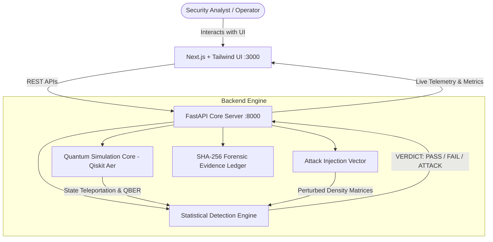

# 🛡️ Q-SHIELD — Quantum Threat Detection Dashboard

<div align="center">


**Smart India Hackathon 2026 (SIH26141) · Egreen Quanta**  
*Blockchain & Cybersecurity Domain — Statistical Quantum Threat Detection & Non-Repudiation Forensic Platform*

[Features](#-key-features) • [Architecture](#-architecture) • [Quick Start](#-quick-start) • [Protocols](#-supported-protocols) • [Attack Lab & Detection](#-attack-vectors--statistical-detection) • [API Reference](#-api-endpoints)

</div>

---

## 📖 Overview

**Q-SHIELD** is an enterprise-grade, post-quantum cybersecurity and digital signature verification system. Designed for critical infrastructure and blockchain networks, Q-SHIELD combines **Qiskit Aer** quantum simulation with rigorous statistical hypothesis testing to detect eavesdropping, state tampering, forgery, and replay attacks on quantum channels in real-time.

By measuring statistical divergences (such as **Total Variation (TV) distance**, **Chi-Squared tests**, and **Quantum Bit Error Rate (QBER)**) against calibrated quantum baselines, Q-SHIELD identifies malicious interference and creates a cryptographic, tamper-proof forensic audit trail.

---

## ✨ Key Features

- 🔬 **Quantum Simulation Lab**: Real-time simulation of Bennett et al. 3-qubit teleportation, polarization states ($|0\rangle, |1\rangle, |+\rangle, |-\rangle$), and configurable shot counts (100–10,000).
- ⚔️ **Attack Injection Engine**: Simulate real-world quantum cyberattacks including Intercept-Resend, Photon Number Splitting (PNS), Entanglement Swapping, State Forgery, and Dephasing/Depolarizing Noise.
- 📊 **Statistical Detection Engine**: High-confidence threat classification using Total Variation Distance, Chi-Squared Goodness of Fit, and Bell Inequality (CHSH) violation checks.
- 📜 **Cryptographic Forensic Chain**: Non-repudiation evidence logging with SHA-256 state-chained audit blocks for forensic verification and compliance.
- 💻 **Interactive Glassmorphic UI**: Ultra-responsive Next.js frontend with live quantum state histograms, fidelity degradation meters, and circuit telemetry.
- ⚡ **One-Click Automation**: Zero-configuration setup script (`run_app.bat`) to provision environments, resolve dependencies, and launch services.

---

## 🏗️ Architecture



---

## 🚀 Quick Start

### Prerequisites
- **Python**: `3.10` or higher
- **Node.js**: `18.0.0` or higher
- **Operating System**: Windows / Linux / macOS

### Option 1: One-Click Launch (Windows Recommended)
Simply double-click or run:
```cmd
.\run_app.bat
```
The script will automatically:
1. Validate Python and Node.js prerequisites.
2. Initialize the Python virtual environment (`backend/venv`) & install dependencies.
3. Install frontend npm packages.
4. Launch the FastAPI backend on `http://localhost:8000`.
5. Launch the Next.js frontend on `http://localhost:3000`.
6. Automatically open your browser to the Q-SHIELD dashboard.

---

### Option 2: Manual Setup

#### 1. Backend Setup (FastAPI + Qiskit)
```bash
cd backend
python -m venv venv

# Windows:
venv\Scripts\activate
# Linux/macOS:
source venv/bin/activate

pip install -r requirements.txt
python main.py
```
*Backend runs at: `http://localhost:8000` (Swagger Docs: `http://localhost:8000/docs`)*

#### 2. Frontend Setup (Next.js)
```bash
cd frontend
npm install
npm run dev
```
*Frontend dashboard runs at: `http://localhost:3000`*

---

## 📡 Supported Protocols

| Protocol | Implementation | Primary Use Case |
| :--- | :--- | :--- |
| **Quantum Teleportation** | 3-Qubit Full State Transfer (Bennett et al.) | Arbitrary quantum signature transfer |
| **BB84 QKD** | Dual-basis photon polarization | Quantum Key Distribution & Sifting |
| **E91 Protocol** | Entangled Bell pairs ($|\Phi^+\rangle$) | CHSH Bell Inequality verification |
| **QDS (Signatures)** | Non-Repudiation Triad (Alice, Bob, Charlie) | Tamper-proof digital quantum transactions |

---

## 🔍 Attack Vectors & Statistical Detection

### Attack Injection Vectors
- **Intercept-Resend Attack**: Eavesdropper measures quantum states in random bases and re-transmits new states, introducing detectable basis-collapse errors.
- **Photon Number Splitting (PNS)**: Attacker taps multi-photon pulses emitted by imperfect single-photon sources.
- **Quantum State Forgery**: Malicious state manipulation attempting to forge sender credentials.
- **Quantum Noise & Phase Flips**: Environmental dephasing and depolarizing channel disturbances.

### Detection Benchmarks
```
• Measurement Baseline: 1.0000 Fidelity (PASS)
• Attack Injected:      0.5000 Fidelity (Detected)
• TV Distance:          0.4860 (Threshold: 0.15) -> FAIL (ATTACK CONFIRMED)
• Confidence Level:     90.0%
```

---

## 🔌 API Endpoints

| Method | Endpoint | Description |
| :--- | :--- | :--- |
| `GET` | `/health` | System health check & version info |
| `POST` | `/api/v1/investigations` | Initialize a new threat investigation session |
| `POST` | `/api/v1/investigations/{id}/experiments/baseline` | Run baseline quantum state simulation |
| `POST` | `/api/v1/investigations/{id}/experiments/attack` | Execute attack injection and test channel |
| `GET` | `/api/v1/investigations/{id}/evidence` | Retrieve cryptographic forensic chain |

---

## 📁 Repository Structure

```
SIH26141/
├── backend/                  # FastAPI & Quantum Simulation Engine
│   ├── attacks/              # Attack injection vectors & noise models
│   ├── detection/            # Statistical test suites (Chi-square, TV distance)
│   ├── quantum/              # Qiskit circuit implementations & telemetry
│   ├── routes/               # REST API endpoints
│   ├── models/               # Pydantic schemas & SQLite ORM
│   ├── services/             # Core orchestrator & forensic ledger
│   ├── requirements.txt      # Python dependencies
│   └── main.py               # Server entrypoint
├── frontend/                 # Next.js 16 Dashboard
│   ├── app/                  # App router, pages & layout
│   ├── components/           # UI components, circuit charts & metric cards
│   ├── lib/                  # API client & utility functions
│   ├── package.json          # Node dependencies
│   └── tailwind.config.ts    # Design styling
├── docs/stitch/              # UI reference artifacts
├── run_app.bat               # Windows one-click automated launcher
├── Test_result_summary.md    # Verified experimental test results
└── README.md                 # Project documentation
```

---

## 👥 Team & Acknowledgments

- **Team**: Egreen Quanta
- **Hackathon**: Smart India Hackathon (SIH 2026)
- **Problem Statement ID**: SIH26141
- **Domain**: Blockchain & Cybersecurity
